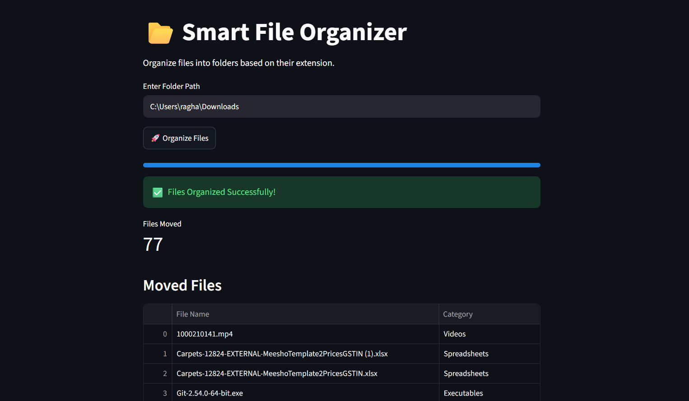
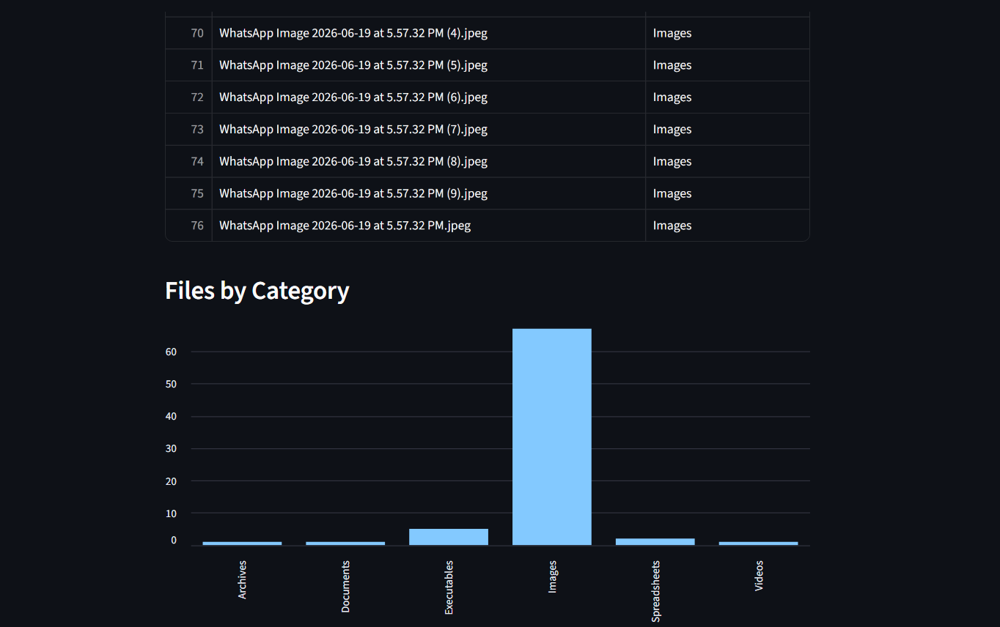

# 📂 Smart File Organizer

A simple File Organizer built using **Python** and **Streamlit**. It automatically sorts files into folders based on their file extensions, making your folders clean and organized.

---

## 🚀 Live Demo

👉 **Live App:** https://file-organiser-1234.streamlit.app/
live demo cant be work

---

## ⚠️ Important Note

This project is designed to organize files stored on your **local computer**.

Because **Streamlit Community Cloud runs on a remote server**, it cannot access folders on your PC (such as `C:\Users\YourName\Downloads`). Therefore, this application **cannot be fully deployed and used on Streamlit Cloud** in its current form.

To use this project, clone or download the repository and run it locally:

```bash
python -m streamlit run app.py


---

## ✨ Features

* 📁 Organizes files automatically
* 🖼 Supports Images
* 🎥 Supports Videos
* 🎵 Supports Audio files
* 📄 Supports Documents
* 💻 Supports Python files
* 🌐 Supports Web files
* 📦 Supports Archives
* ⚙ Supports Executable files
* 📊 Displays the list of moved files
* 📈 Shows a category-wise chart

---

## 🛠 Technologies Used

* Python
* Streamlit
* Pandas
* OS Module
* Shutil Module

---

## 📷 Screenshots

### Home Page



### After Organizing Files



---

## 📂 Project Structure

```text
Smart-File-Organizer/
│
├── app.py
├── requirements.txt
├── README.md
└── screenshots/
    ├── home.png
    └── result.png
```

---

## ▶️ Run Locally

1. Clone the repository

```bash
git clone https://github.com/raghavguglani21/File-organiser.git
```

2. Open the project folder

```bash
cd File-organiser
```

3. Install the required packages

```bash
pip install -r requirements.txt
```

4. Run the application

```bash
streamlit run app.py
```

---

## 📄 License

This project is created for learning and educational purposes.

---

## 👨‍💻 Author

**RAGHAV GUGLANI**

If you like this project, feel free to ⭐ the repository!
